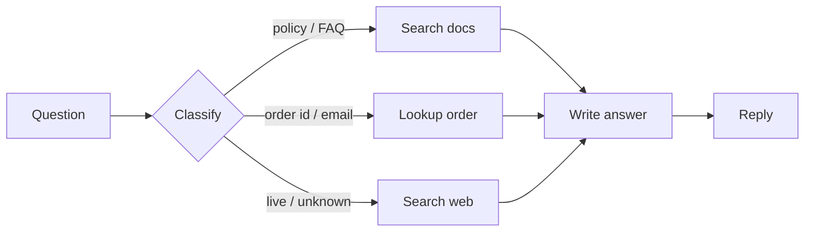
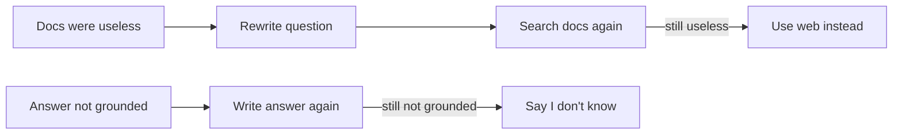

# How SupportIQ works

Onboarding note for anyone opening this repo cold. A visual version of the
same story lives in the Cursor canvas
`supportiq-adaptive-rag-guide.canvas.tsx` (open beside chat).

## 1. Business problem

**NexCart** is a fictional mid-size e-commerce company. Support agents and
customers type mixed questions into one box. Those questions are not one
problem:

| Type | Example | Truth lives in | Plain vector RAG? |
|---|---|---|---|
| Policy / FAQ / product | “What’s your return window?” | Internal docs | Yes |
| Structured account data | “Where is order #4521?” | Orders table | No — embeddings don’t know live rows |
| Current / out of scope | “Is UPS down right now?” | The public web | No — the KB is stale / empty |

If we only did “embed the question, fetch similar chunks, generate,” order
lookups would be wrong and outage questions would be hallucinated.

## 2. Solution in one sentence

**Adaptive RAG:** classify the question → retrieve from the *matching* source
→ grade whether that context actually helps → generate → grade whether the
answer is grounded. Rewrite retrieval at most once; regenerate the answer at
most once.

That pattern combines:

- **Adaptive RAG** (Jeong et al.) — route simple vs complex queries
- **Corrective RAG** (Yan et al.) — drop irrelevant chunks, fall back
- **Self-RAG** — check the generated answer against context

We implemented it as a **LangGraph** state machine so the branches and loops
are explicit, not a pile of `if` statements.

## 3. What we built (phases)

0. Local env: Python 3.12, Ollama `llama3.2` + `nomic-embed-text`, Langfuse v2 Docker
1. Ingest markdown → Chroma; seed SQLite orders
2. LangGraph nodes + conditional edges
3. Langfuse traces + scores
4. FastAPI `/health` `/ingest` `/chat`
5. Streamlit chat UI
6. 15-question routing eval (14/15 = 93% on this laptop)

## 4. Offline pipeline (ingest)

```
data/docs/*.md
        │
        ▼
  load markdown
        │
        ▼
  chunk (~500 tokens, 50 overlap)
        │
        ▼
  embed with nomic-embed-text
        │
        ▼
  persist Chroma  ./chroma_db  (11 chunks)
```

In parallel: seed `data/orders.db` (10 rows, including order `4521`).

Command: `python -m src.ingestion.embed_and_store`

## 5. Online pipeline (every question)

**Happy path** — three doors, then the same last step (no arrows going backward):



**Only if something failed** (each step at most once):



The LangGraph code still has cycles; they are capped at 1 rewrite and 1 regeneration. These pictures are the same logic without drawing loops.

## 6. Graph nodes (what each step is)

| Node | Role | Model / system |
|---|---|---|
| `classify_query` | Pick vectorstore / sql / web | llama3.2 + Pydantic `RouteDecision` |
| `retrieve` | Similarity search k=4 | Chroma + nomic-embed-text |
| `grade_documents` | Keep only useful chunks | llama3.2 + `DocumentGrades` |
| `rewrite_query` | Better search query | llama3.2 + `RewrittenQuery` |
| `sql_lookup` | Order id / email → row | SQLite |
| `web_search` | Live snippets | DuckDuckGo (`ddgs`); Tavily optional |
| `generate` | Answer from context only | llama3.2 |
| `grade_answer` | Groundedness check | llama3.2 + `AnswerGrade` |

State is a `TypedDict` in `src/graph/state.py`. Wiring is
`src/graph/build_graph.py` (`add_conditional_edges`, not ad-hoc if/else).

## 7. Tools map

| Layer | Tool | Why |
|---|---|---|
| LLM | Ollama `llama3.2` | Local, no paid API |
| Embeddings | Ollama `nomic-embed-text` | Local 768-d vectors |
| Orchestration | LangGraph | Branches + cycles with limits |
| Loaders / splitters | LangChain | Standard RAG glue |
| Vector DB | Chroma embedded | No extra server |
| Orders | SQLite | Structured route |
| Web | DuckDuckGo | No search API key |
| Tracing | Langfuse v2 | See routing and grades |
| API | FastAPI | `/chat` returns `trace_url` |
| UI | Streamlit | Route badge + trace link |

Everything except web search runs on the laptop.

## 8. Core RAG concepts (so you can improve it)

**Retrieval-Augmented Generation** = do not ask the LLM to memorize the
company. At ask-time, fetch evidence, then generate *conditioned on that
evidence*.

Pieces you will keep meeting:

1. **Chunking** — too big loses precision; too small loses context. We used
   ~500 tokens / 50 overlap.
2. **Embeddings** — map text to vectors so “return window” is near “30 days
   of delivery.” Query and documents **must use the same model**.
3. **Top-k** — we take 4 neighbors. Higher k = more recall, more noise.
4. **Grounding** — the answer must be supported by retrieved text. That is
   what `grade_answer` is for.
5. **Routing** — not every question is a vector question. That is Adaptive RAG.
6. **Fallback** — if internal memory fails, web search (Corrective RAG).

## 9. How to run and watch it

```bash
source .venv/bin/activate
docker compose -f docker-compose.langfuse.yml up -d
python -m src.ingestion.embed_and_store   # if chroma_db missing
uvicorn src.api.main:app --host 127.0.0.1 --port 8000
# other terminal:
streamlit run ui/streamlit_app.py
```

Langfuse UI: http://localhost:3000 — `admin@example.com` / `password123`.

Ask:

- `What's your return window?` → `vectorstore`
- `Where is order #4521?` → `sql_lookup`
- `Is there a major UPS outage right now?` → `web_search`

Open `trace_url` in the JSON/UI to see classify → retrieve → grades.

Eval: `python eval/run_eval.py` (slow: 15 full graph runs).

## 10. Sensible next experiments

- Hybrid search (BM25 + vectors) for policy FAQs
- A tiny trained router instead of llama3.2 JSON for the 3-way classify
- Human labels for *answer quality*, not only routing accuracy
- Qdrant instead of Chroma; real orders API instead of SQLite
- Fourth route: past support tickets

Start by reading `src/graph/nodes.py` then `src/graph/build_graph.py`.
That is the whole Adaptive RAG loop in code.
