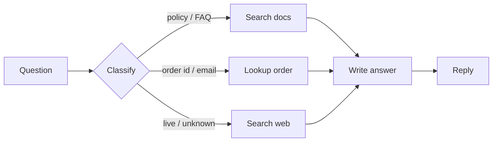
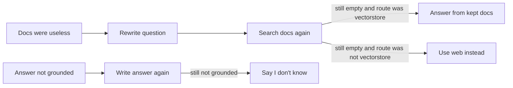

# How SupportIQ works

Onboarding note for anyone opening this repo cold.

## 1. Business problem

**NexCart** is a fictional mid-size e-commerce company. Support agents and
customers type mixed questions into one box. Those questions are not one
problem:

| Type | Example | Truth lives in | Plain vector RAG? |
|---|---|---|---|
| Policy / FAQ / product | “What’s your return window?” | Internal docs | Yes |
| Structured account data | “Where is order #4521?” | Orders table | No — embeddings don’t know live rows |
| Current / out of scope | “Is UPS down right now?” | The public web | No — the KB is stale / empty |

If we only did “embed the question, fetch similar chunks, generate,” order
lookups would be wrong and outage questions would be hallucinated.

## 2. Solution in one sentence

**Adaptive RAG:** classify the question → retrieve from the *matching* source
→ grade whether that context actually helps → generate → grade whether the
answer is grounded. Rewrite retrieval at most once; regenerate the answer at
most once.

That pattern combines:

- **Adaptive RAG** (Jeong et al.) — route simple vs complex queries
- **Corrective RAG** (Yan et al.) — drop irrelevant chunks, fall back
- **Self-RAG** — check the generated answer against context

We implemented it as a **LangGraph** state machine so the branches and loops
are explicit, not a pile of `if` statements.

## 3. What we built (phases)

0. Local env: Python 3.12, Ollama `llama3.2` + `nomic-embed-text`, Langfuse v2 Docker
1. Ingest → Chroma; seed SQLite orders
2. LangGraph nodes + conditional edges
3. Langfuse traces + scores
4. FastAPI `/health` `/ingest` `/chat`
5. 15-question routing eval
6. **P1 quality** — hybrid retrieve, `doc_type` metadata, embedding router, citations  
   Golden routing after P1: **15/15 (100%)**. Lexical `must_contain` and groundedness are extra scores; they can still fail on SQL/web answers.
7. **PDF knowledge base** — PyMuPDF layout extract; citations are file + page + bbox/polygon; `/pdf-preview` renders the page
8. **Production folders + console** — `ai/` (RAG), `backend/` (FastAPI), `frontend/` (React). Ruff is the Python linter.
9. **Observability on the same screen** — this-run metrics + Langfuse graph steps via `GET /traces/{id}` (the Langfuse web UI cannot be iframed)
10. **Token counts for both local models** — Ollama `prompt_eval_count` / `eval_count` for llama3.2 and nomic-embed-text, returned on `/chat` as `usage` and scored in Langfuse
11. **Pluggable vector index** — `VECTOR_BACKEND=chroma|supabase`. Same hybrid retrieve (dense + lexical + RRF). Embeddings stay local `nomic-embed-text` (768-d). One backend per process; the flag does not copy vectors.

## 4. Repo map

```
frontend/          product console
backend/           FastAPI  (uvicorn backend.main:app)
ai/                ingest, graph, retrieve, router, tools
  retrieval/       VectorIndex: Chroma or Supabase
  retrieval/supabase.sql  one-time schema reset (not every ingest)
  models/          trained sklearn router (router.joblib)
  eval/            golden questions + train labels
data/pdfs/         knowledge base
data/chroma/       local Chroma index (gitignored)
```

Vite proxies `/api` → `http://127.0.0.1:8000`.

## 5. Offline pipeline (ingest)

```
data/pdfs/*.pdf
        │
        ▼
  PyMuPDF layout extract
  (drop header/footer, cluster lines)
        │
        ▼
  region chunks (~500 tokens)
  + metadata: source_file, page, bbox, polygon, polygon_norm, doc_type
        │
        ▼
  embed with nomic-embed-text
        │
        ▼
  VECTOR_BACKEND (one store, not both)
     chroma   → ./data/chroma
     supabase → public.supportiq_chunks  (pgvector)
```

SQL in `ai/retrieval/supabase.sql` is **schema only**: drop/recreate table,
indexes, RLS, `match_chunks`, `search_chunks_fts`. Run it once in the SQL
editor (or when you want a wipe). Ingest writes the 768-d rows; do not re-run
the SQL for every PDF update.

Two NexCart PDFs (generated, not downloaded):

- `nexcart_return_exchange_policy.pdf` — return window, how to return, warranty
- `nexcart_product_troubleshooting.pdf` — PulseBuds, HomePlug, LockStep, GlowBar

Markdown in `data/docs/` is unused at ingest time. A citation is **file + page + bounding quad**, not a filename alone. The evidence pane loads `/pdf-preview?source=&page=&x0=&y0=&x1=&y1=` and draws that region.

Commands:

```bash
python -m ai.ingestion.make_nexcart_pdfs
python -m ai.ingestion.embed_and_store
python -m ai.router.train
```

## 6. Online pipeline (every question)

**Happy path** — three doors, then the same last step (no arrows going backward):



**Only if something failed** (each step at most once):



If classify chose **vectorstore**, we do **not** fall through to web search after a
failed grade. Short PDF chunks used to be marked irrelevant, which sent every
policy question to DuckDuckGo. The grader is lenient on short snippets; leftover
docs are still passed to generate.

The LangGraph code still has cycles; they are capped at 1 rewrite and 1 regeneration.

**Classify is not “always llama3.2.”** `classify_query` calls `route_question` (`ai/router/embed_router.py`):

```
question
   │
   ├─ 1. Heuristic — order id / email → sql_lookup
   │               live phrases (outage, today, weather, …) and not a NexCart product → web_search
   ├─ 2. sklearn — embed with nomic-embed-text, LogisticRegression, use if p ≥ 0.55
   └─ 3. LLM — only if sklearn is unsure or router.joblib is missing
```

The `/chat` field `router_backend` is `heuristic`, `sklearn`, or `llm`.

**Retrieve is hybrid.** `retrieve` calls `hybrid_search` (`ai/retrieval/hybrid.py`).
`VECTOR_BACKEND` chooses the store (`chroma` or `supabase`): dense neighbors plus
a lexical list (BM25 on Chroma, Postgres FTS on Supabase), fused with RRF, plus a
small boost if `doc_type` matches the question (e.g. “pair” → troubleshooting).

## 7. Graph nodes (what each step is)

| Node | Role | Model / system |
|---|---|---|
| `classify_query` | Pick vectorstore / sql / web | heuristic → sklearn on embeddings → llama3.2 `RouteDecision` only if needed |
| `retrieve` | Hybrid search k=4 | PDF chunks via Chroma BM25 or Supabase pgvector+FTS |
| `grade_documents` | Keep only useful chunks | llama3.2 + `DocumentGrades` |
| `rewrite_query` | Better search query | llama3.2 + `RewrittenQuery` |
| `sql_lookup` | Order id / email → row | SQLite |
| `web_search` | Live snippets | DuckDuckGo (`ddgs`); Tavily optional |
| `generate` | Answer from context only | llama3.2 |
| `grade_answer` | Groundedness check | llama3.2 + `AnswerGrade` |

State is a `TypedDict` in `ai/graph/state.py`. Wiring is
`ai/graph/build_graph.py` (`add_conditional_edges`, not ad-hoc if/else).

## 8. Token consumption (both models)

Every `/chat` call starts a per-request counter (`ai/observability/usage.py`).

| Model | What we count | Where it comes from |
|---|---|---|
| `llama3.2` | prompt (in) + completion (out) tokens, call count | Ollama `prompt_eval_count` / `eval_count` on chat responses (`usage_metadata` / `response_metadata`) |
| `nomic-embed-text` | prompt tokens, call count | Ollama `/api/embed` `prompt_eval_count` (query embed + hybrid retrieve) |

Those totals are:

- returned as `ChatResponse.usage`
- shown on Observability → **This run** (and copied onto the Langfuse tab)
- written as Langfuse scores: `llama_prompt_tokens`, `llama_completion_tokens`, `nomic_embed_tokens`

Ingest embeddings (building the index) are **not** billed to a chat request. Only
embeds that happen while answering.

## 9. Tools map

| Layer | Tool | Why |
|---|---|---|
| LLM | Ollama `llama3.2` | Local, no paid API |
| Embeddings | Ollama `nomic-embed-text` | Local 768-d vectors |
| Orchestration | LangGraph | Branches + cycles with limits |
| Loaders / splitters | PyMuPDF + LangChain | PDF line boxes, then optional MD fallback |
| Vector DB | Chroma or Supabase pgvector | `VECTOR_BACKEND` in `.env` |
| Keyword retrieve | BM25 or Postgres FTS | Fused with vectors (RRF) |
| Router | sklearn LogisticRegression | 3-way classify on nomic embeddings |
| Orders | SQLite | Structured route |
| Web | DuckDuckGo | No search API key |
| Tracing | Langfuse v2 | Routing, grades, token scores |
| API | FastAPI | `/chat` returns `trace_url`, `citations`, `usage` |
| UI | React (`frontend/`) | Chat + PDF highlight + inspector |
| Lint | Ruff | `ai`, `backend` |

Embeddings always run on the laptop. Web search and (optional) Supabase leave
the machine. Orders stay in SQLite.

## 10. Core RAG concepts (so you can improve it)

**Retrieval-Augmented Generation** = do not ask the LLM to memorize the
company. At ask-time, fetch evidence, then generate *conditioned on that
evidence*.

Pieces you will keep meeting:

1. **Chunking** — too big loses precision; too small loses context. We used
   ~500 tokens / 50 overlap.
2. **Embeddings** — map text to vectors so “return window” is near “30 days
   of delivery.” Query and documents **must use the same model**.
3. **Top-k** — we take 4 neighbors. Higher k = more recall, more noise.
4. **Hybrid retrieve** — vectors catch paraphrases; lexical search catches exact
   tokens (“30 days”, “pair”). Chroma uses BM25 in Python; Supabase uses
   Postgres full-text. RRF merges both ranked lists.
5. **Grounding** — the answer must be supported by retrieved text. That is
   what `grade_answer` is for. Citations are file, **page**, **bbox**, and a
   4-corner **polygon** (PDF points + 0–1 normalized) so you can highlight the
   region on the page.
6. **Routing** — not every question is a vector question. Rules catch IDs;
   a tiny classifier on embeddings handles the rest; LLM is the fallback.
7. **Fallback** — web search is for live/out-of-scope questions, not for
   “the PDF chunk was short.”

## 11. How to run and watch it

```bash
source .venv/bin/activate
docker compose -f docker-compose.langfuse.yml up -d
python -m ai.ingestion.make_nexcart_pdfs
python -m ai.ingestion.embed_and_store   # writes Chroma or Supabase per VECTOR_BACKEND
python -m ai.router.train                # if ai/models/router.joblib missing
uvicorn backend.main:app --host 127.0.0.1 --port 8000
# not: uvicorn src.api.main:app
# other terminal:
cd frontend && npm install && npm run dev
```

Langfuse UI: http://localhost:3000 — `admin@example.com` / `password123`.
Console: http://localhost:5173.

Ask:

- `What's your return window?` → `vectorstore`
- `PulseBuds will not pair` → `vectorstore` (PDF troubleshooting + page highlight)
- `Where is order #4521?` → `sql_lookup`
- `Is there a major UPS outage right now?` → `web_search`

After an answer, Observability → This run shows route, grades, llama3.2 tokens,
and nomic-embed tokens. Langfuse tab lists scores and graph step names (fetched
through our API, not an iframe).

Eval: `python -m ai.eval.run_eval` (slow: 15 full graph runs).

Stop:

```bash
lsof -tiTCP:8000 -sTCP:LISTEN | xargs kill
docker compose -f docker-compose.langfuse.yml down
```

## 12. Sensible next experiments

- Tighten SQL/web generation so lexical + groundedness match routing
- Human labels for *answer quality*, not only routing accuracy
- Move orders off SQLite onto a real orders API (or the same Supabase project)
- Fourth route: past support tickets

Start by reading `ai/graph/nodes.py` then `ai/graph/build_graph.py`.
That is the whole Adaptive RAG loop in code.
